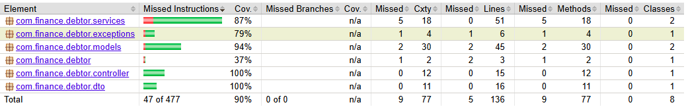

# Debtor API 💰

This is the back-end for a financial control and debtor/expense management application. Developed as a **RESTful API** using **Java** and the **Spring Boot** ecosystem, it allows for complete management of users and their respective financial transaction records (expense database).

The project adopts the MVC architecture pattern (focused on Controllers and Repositories) and uses Spring Data JPA for persistent database communication.

## 🛠️ Technologies Used

* **Java 17+** (or your current version)
* **Spring Boot 3.x**
* **Spring Data JPA** (Data persistence)
* **Hibernate** (ORM provider)
* **Lombok** (Productivity and boilerplate reduction)
* **Jakarta Persistence** (Entity mapping annotations)

## 🏗️ Architecture and Entities

The system was modeled using relational database concepts (`@OneToMany` and `@ManyToOne`):

1. **User:** Represents the user account (ID, first name, last name, email, and password). A user can have multiple financial records tied to them.
2. **Data_Bank (Transactions):** Represents expenses and financial data (Product ID, item bought, price, category, date, payment method, etc.). Each transaction belongs to exactly one single user.

## 🛣️ API Endpoints

The API provides the following endpoints structured for Front-end consumption:

### User Management (`/`)
* `GET /users` - Returns a list of all registered users.
* `POST /save` - Creates a new user in the system.
* `PUT /update/{id}` - Updates an existing user's data (Name, Email, Password).
* `DELETE /delete/{id}` - Removes a user from the database.

### Financial Transactions Management (`/bank`)
* `GET /bank` - Returns a list of all logged expenses.
* `POST /saveBank` - Registers a new financial expense.
* `PUT /updateBank/{ProductId}` - Updates data for a specific expense.
* `DELETE /deleteBank/{ProductId}` - Removes a financial transaction by its ID.

## 🚀 How to Run Locally

1. Clone the repository:
   ```bash
   git clone [https://github.com/YOUR_USERNAME/debtor-api.git](https://github.com/YOUR_USERNAME/debtor-api.git)
Open the project in your preferred IDE (IntelliJ IDEA, Eclipse, VS Code).

Ensure your database configurations (e.g., H2, MySQL, or PostgreSQL) are set up in the src/main/resources/application.properties file.

Run the DebtorApplication.java main class.

The API will be available at: http://localhost:8080

📝 Next Steps (To-Do)

[ ] Implement global exception handling (prevent 500 errors when fetching non-existent IDs).

[ ] Integrate with a production database (PostgreSQL/MySQL).

[ ] Add security with Spring Security and JWT authentication.

[ ] Develop the Front-end in Next.js/React to consume this API.

## 🚀 Deploy em Produção
O aplicativo está hospedado utilizando plataformas PaaS modernas. O backend está provisionado na **Render**, consumindo o banco de dados **MySQL hospedado na Aiven**. Variáveis de ambiente foram utilizadas para ocultar credenciais e rotas de conexão.
- **Link da API**: https://debtor-api-81qs.onrender.com
- **Interface Gráfica**: https://debtorfront.onrender.com/

## 💻 Exemplos de Uso (cURL)
```bash
# Adicionar um novo gasto
curl -X POST [https://debtor-api-81qs.onrender.com/saveBank/user/1](https://debtor-api-81qs.onrender.com/saveBank/user/1) \
-H "Content-Type: application/json" \
-d '{"itemBought":"Monitor","price":850.50,"category":"Casa","paymentMethod":"Cartão","date":"2026-06-10"}'
```
## 📝 Relatório do JaCoCo


## Atribuições
Felipe Lira - Back-End
Gérard Mourão - Interface Gráfica
Jean Mendes - Front-End
João Lucas - Interface Gráfica
Eduardo Barreto - Back-End
Ryan Moreira - Banco de Dados
Arthur Pereira - Banco de Dados
